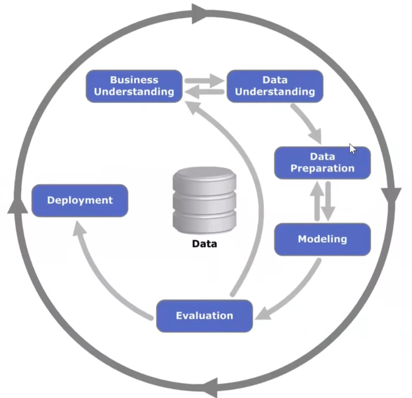

# Supervised Machine Learning

### Types
- Regression
- Classification
  - Multi class
  - Binary
- Ranking

### g(**X**) ≈ y
- Feature Matrix ( **X** ): 2d matrix
  - Columns: Features
  - Rows: Observations
- Target vector ( **y** ): Output
- g is our model, where we take X as input and try to produce y as accurate possible

## CRISP - DM

